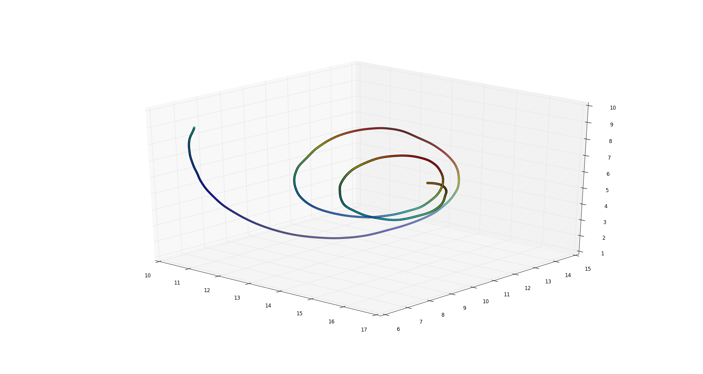
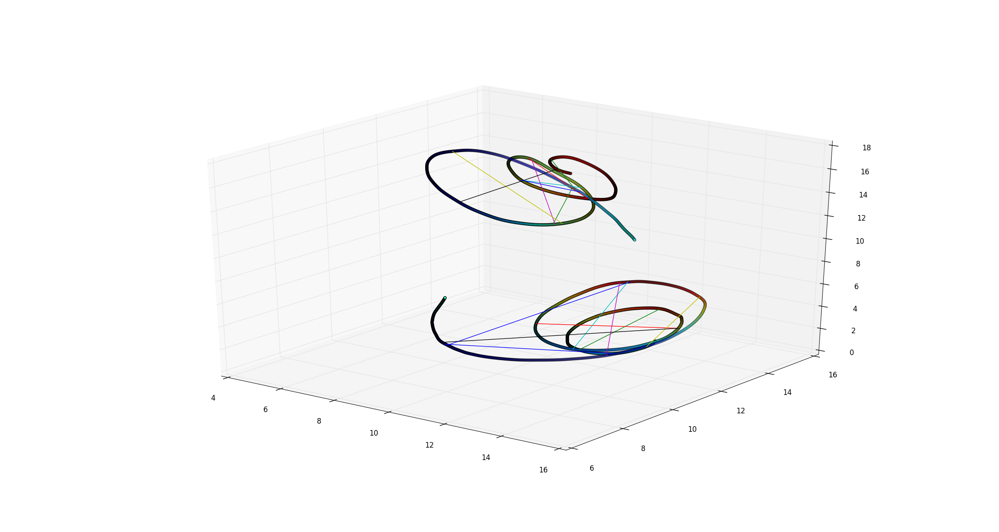

# Cochleas analysis

The cochleas are organs inside our ears. They look like spirals, as can be seen in the following image.

[Axel Bellec](https://github.com/Belekkk) and I had a university assignment where we had to determine if the gender of an individual could be inferred by studying one of it's cochleas.

Each cochlea is represented by 1000 3D points. With these we built a 1000x1000 distance matrix for each gender and extracted significant distances. In the end we obtained graphs of the following kind.

Each link represents a significant distance. We built confidence intervals for both men and women.

The R script and the Python script do pretty much the same, however the R one is commented in French whereas the Python one is in English

The full report is available in French as a PDF in the folder.

Sadly you will not be able to exactly reproduce the previous graphs and the ones in the report because they were done with restricted data. The files in the ``data`` folder are fake but they still work fine.